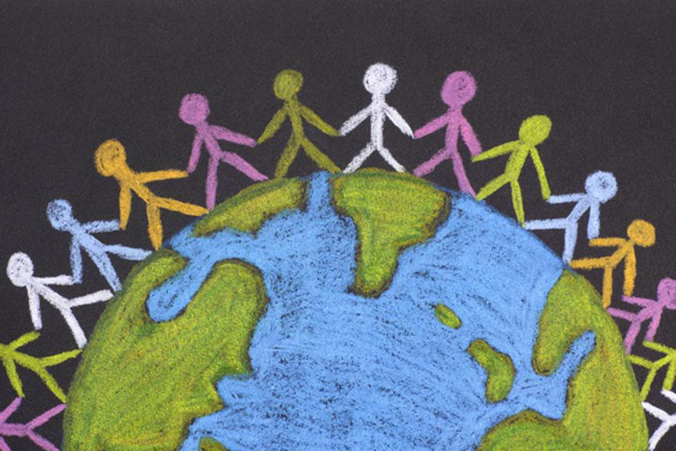

# Overview

The annual World Happiness Report for 2022 was released Friday, March 18th, and according to the ranking, the U.S. moved up three spots from last year. Now, at a time of pandemic and war, we need such an effort more than ever, and the lesson of the World Happiness Report over the years is that social support, generosity to one another, and honesty in government are crucial for well-being. 	How do these factors influence our happiness?

# Summary of Our Project
We use the data set from [kaggle](https://www.kaggle.com/datasets/ajaypalsinghlo/world-happiness-report-2021?resource=download&select=world-happiness-report.csv), trying to explore the relationship between the happiness ladder score and other social factors.

In the exploratory analysis part, we:

- Summaries the basic statistics over variables.
- Visually analyse the happiness ladder score and other metrics over different region.

We also perform statistical analysis including:

- Statistical test comparing mean ladder score over regions, pre/post covid period, difference in social factors and distribution of ladder score over happy/unhappy region.
- Regression analysis selecting the optimal subset of social factors that help us understand their relationships with happiness ladder score.
- Principle component analysis and principle component regression.

For our reader to freely explore our data and try to understand our model, we provide a interactive shiny app for people to:

- Try how different values to see how do they affect the ladder score
- Compare user selected variables over different countries/regions
- Check associations between each pair of factors.

Final report can be access [here](Report.html) or there is an entry on the right corner.
Detailed code and output of each section are in the navigation bar.

# Members
[Jingya Yu](https://jy3270.github.io/) (jy3270)

[Landi Guo](https://lllandiG.github.io/) (lg3239)

[Fengdi Zhang](https://fengdi-zhang.github.io/) (fz2352)

[Meng Fang](https://fmmeng0726.github.io/) (mf3532)

[Yixuan Jiao](https://yixuanjiao04.github.io/) (yj2752)
