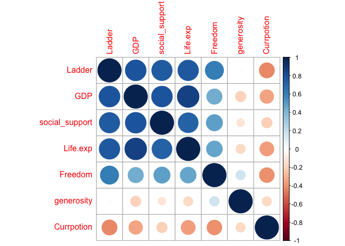
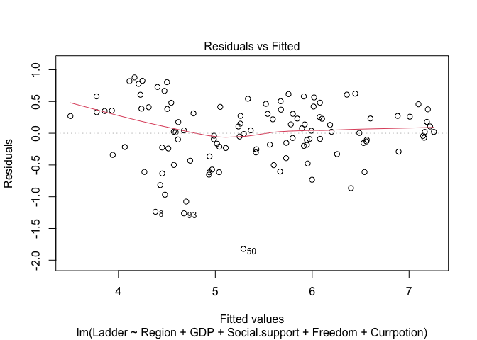
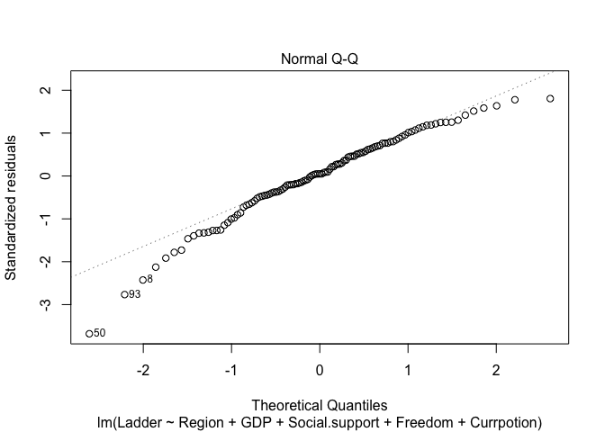
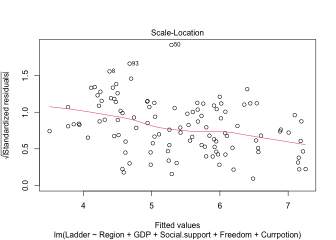
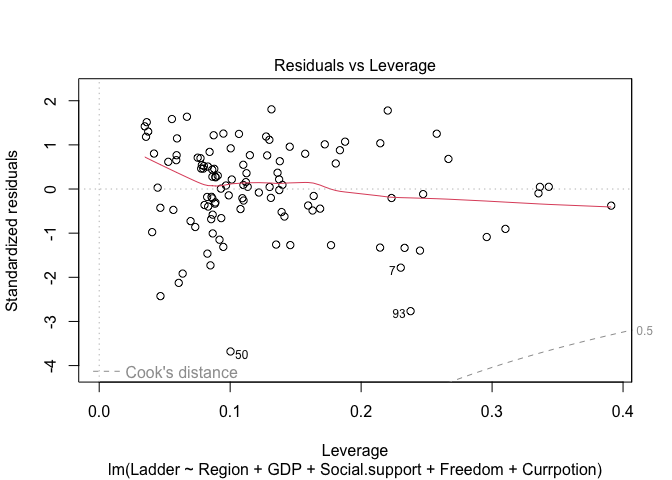

Regression analysis
================
Jingya Yu
2022-12-04

``` r
library(readr)
library(dplyr)
```

    ## 
    ## Attaching package: 'dplyr'

    ## The following objects are masked from 'package:stats':
    ## 
    ##     filter, lag

    ## The following objects are masked from 'package:base':
    ## 
    ##     intersect, setdiff, setequal, union

``` r
library(corrplot)
```

    ## corrplot 0.92 loaded

``` r
library(ggplot2)
library(MASS)
```

    ## 
    ## Attaching package: 'MASS'

    ## The following object is masked from 'package:dplyr':
    ## 
    ##     select

Here I am interested in which features best predict the outcome - Ladder
Score. I am considering a multiple linear regression to see how
variables relate to the outcome. Once important question that I am
interested in is how much does GDP impacts the Ladder Score.

## regression data import

``` r
regression_df = 
  read_csv("data/world-happiness-report-2021.csv") %>% 
  janitor::clean_names() 
head(regression_df)
```

    ## # A tibble: 6 × 20
    ##   country_name regiona…¹ ladde…² stand…³ upper…⁴ lower…⁵ logge…⁶ socia…⁷ healt…⁸
    ##   <chr>        <chr>       <dbl>   <dbl>   <dbl>   <dbl>   <dbl>   <dbl>   <dbl>
    ## 1 Finland      Western …    7.84   0.032    7.90    7.78    10.8   0.954    72  
    ## 2 Denmark      Western …    7.62   0.035    7.69    7.55    10.9   0.954    72.7
    ## 3 Switzerland  Western …    7.57   0.036    7.64    7.5     11.1   0.942    74.4
    ## 4 Iceland      Western …    7.55   0.059    7.67    7.44    10.9   0.983    73  
    ## 5 Netherlands  Western …    7.46   0.027    7.52    7.41    10.9   0.942    72.4
    ## 6 Norway       Western …    7.39   0.035    7.46    7.32    11.1   0.954    73.3
    ## # … with 11 more variables: freedom_to_make_life_choices <dbl>,
    ## #   generosity <dbl>, perceptions_of_corruption <dbl>,
    ## #   ladder_score_in_dystopia <dbl>, explained_by_log_gdp_per_capita <dbl>,
    ## #   explained_by_social_support <dbl>,
    ## #   explained_by_healthy_life_expectancy <dbl>,
    ## #   explained_by_freedom_to_make_life_choices <dbl>,
    ## #   explained_by_generosity <dbl>, …

## variable description

-   Ladder Score or Happiness Score: “Please imagine a ladder, with
    steps numbered from 0 at the bottom to 10 at the top. The top of the
    ladder represents the best possible life for you and the bottom of
    the ladder represents the worst possible life for you. On which step
    of the ladder would you say you personally feel you stand at this
    time?”.

-   Log GDP per capita: It is the total monetary or market value of all
    the finished goods and services produced within a country’s borders
    in a specific time period.

-   Healthy life expectancy: Based on the data extracted from the World
    Health Organization’s (WHO)

-   Social Suport: “If you were in trouble, do you have relatives or
    friends you can count on to help you whenever you need them, or
    not?”.

-   Freedom to make life choices: “Are you satisfied or dissatisfied
    with your freedom to choose what you do with your life?”

-   Generosity: “Have you donated money to a charity in the past month?”
    on GDP per capita.

-   Corruption Perception: “Is corruption widespread throughout the
    government or not” and “Is corruption widespread within businesses
    or not?”

## change column names and check if there is na

``` r
regression_df$country_name <- as.factor(regression_df$country_name)

regression_df$regional_indicator<- as.factor(regression_df$regional_indicator)

regression_df <- regression_df %>%
  rename(Country = country_name, Region = regional_indicator, Ladder = ladder_score,
         SD.Ladder = standard_error_of_ladder_score, GDP = logged_gdp_per_capita, Social.support = social_support,
         Life.exp = healthy_life_expectancy, Freedom = freedom_to_make_life_choices,
         Currpotion = perceptions_of_corruption, Ladder.Dystopia = ladder_score_in_dystopia,
         EXP.LOG.GPD = explained_by_log_gdp_per_capita, EXP.SS = explained_by_social_support,
         EXP.HLE = explained_by_healthy_life_expectancy, EXP.FREE = explained_by_freedom_to_make_life_choices,
         EXP.GEN = explained_by_generosity, EXP.CUR = explained_by_perceptions_of_corruption,
         DYS.RES = dystopia_residual)

hap <- regression_df[,-c(4,5,6,13:20)]
colnames(hap)
```

    ## [1] "Country"        "Region"         "Ladder"         "GDP"           
    ## [5] "Social.support" "Life.exp"       "Freedom"        "generosity"    
    ## [9] "Currpotion"

``` r
sum(is.na(regression_df)) # there is no na
```

    ## [1] 0

## Now, I would like to check the correlations between each of the variables. In order to use use the cor() function, the variables need to be numeric. I use the select_if() function on the hap dataframe and select the data that is numeric.

## Then we print the correlation matrix and plot the correlation graph.

``` r
num.var <- select_if(hap, is.numeric)
M<-cor(num.var)
M
```

    ##                     Ladder        GDP Social.support   Life.exp    Freedom
    ## Ladder          1.00000000  0.7897597      0.7568876  0.7680995  0.6077531
    ## GDP             0.78975970  1.0000000      0.7852987  0.8594606  0.4323235
    ## Social.support  0.75688765  0.7852987      1.0000000  0.7232561  0.4829298
    ## Life.exp        0.76809946  0.8594606      0.7232561  1.0000000  0.4614939
    ## Freedom         0.60775307  0.4323235      0.4829298  0.4614939  1.0000000
    ## generosity     -0.01779928 -0.1992864     -0.1149459 -0.1617503  0.1694374
    ## Currpotion     -0.42114000 -0.3423374     -0.2032070 -0.3643735 -0.4013630
    ##                 generosity Currpotion
    ## Ladder         -0.01779928 -0.4211400
    ## GDP            -0.19928640 -0.3423374
    ## Social.support -0.11494585 -0.2032070
    ## Life.exp       -0.16175028 -0.3643735
    ## Freedom         0.16943737 -0.4013630
    ## generosity      1.00000000 -0.1639617
    ## Currpotion     -0.16396173  1.0000000

``` r
corrplot(M)
```

<!-- -->

## Split the data into a training and validation set.

``` r
#Data Partitioning
set.seed(10)

#select sample size of training data (75% of data for train, 25% for validation)
sample_size <- floor(0.75 * nrow(hap))

# using sample() to select sample of specific size without replacement
# seq_len() generates a regular sequence - defined here as nrow (number of rows) of our data
# size is setting how large the sequence is (111)
train_ind <- sample(seq_len(nrow(hap)), size = sample_size)

#creating train data based on train_ind
train <- hap[train_ind,]
#test data is what is left over after train_ind is taken out
test <- hap[-train_ind,]
```

## use North America and ANZ as a reference group for comparision

``` r
str(hap$Region)
```

    ##  Factor w/ 10 levels "Central and Eastern Europe",..: 10 10 10 10 10 10 10 10 6 10 ...

``` r
levels(hap$Region)
```

    ##  [1] "Central and Eastern Europe"         "Commonwealth of Independent States"
    ##  [3] "East Asia"                          "Latin America and Caribbean"       
    ##  [5] "Middle East and North Africa"       "North America and ANZ"             
    ##  [7] "South Asia"                         "Southeast Asia"                    
    ##  [9] "Sub-Saharan Africa"                 "Western Europe"

``` r
hap$Region<- relevel(hap$Region, ref="North America and ANZ")
```

## use stepwise comparision to select the model with the lowest AIC. I also take a peek at the null model, which is just the intercept (mean) of the outcome variable. Once I get the best performing model, I take a look at the residuals to see how the model performs. Overall the residuals seem normally distributed and most assumptions seem to be maintained.

## But, the Scale-Location plot does show some heteroskedasticity, where the variance increases a bit around the center.

``` r
#Modeling
summary(train)
```

    ##       Country                                   Region       Ladder     
    ##  Albania  :  1   Sub-Saharan Africa                :31   Min.   :3.145  
    ##  Algeria  :  1   Western Europe                    :14   1st Qu.:4.673  
    ##  Argentina:  1   Central and Eastern Europe        :13   Median :5.345  
    ##  Armenia  :  1   Latin America and Caribbean       :13   Mean   :5.413  
    ##  Australia:  1   Middle East and North Africa      :12   3rd Qu.:6.143  
    ##  Austria  :  1   Commonwealth of Independent States: 8   Max.   :7.571  
    ##  (Other)  :105   (Other)                           :20                  
    ##       GDP         Social.support      Life.exp        Freedom      
    ##  Min.   : 6.635   Min.   :0.4890   Min.   :48.48   Min.   :0.4800  
    ##  1st Qu.: 8.456   1st Qu.:0.7255   1st Qu.:59.29   1st Qu.:0.7180  
    ##  Median : 9.487   Median :0.8210   Median :66.40   Median :0.7950  
    ##  Mean   : 9.333   Mean   :0.8032   Mean   :64.60   Mean   :0.7906  
    ##  3rd Qu.:10.297   3rd Qu.:0.8980   3rd Qu.:69.15   3rd Qu.:0.8780  
    ##  Max.   :11.647   Max.   :0.9830   Max.   :76.95   Max.   :0.9700  
    ##                                                                    
    ##    generosity         Currpotion    
    ##  Min.   :-0.28800   Min.   :0.0820  
    ##  1st Qu.:-0.12400   1st Qu.:0.6655  
    ##  Median :-0.03000   Median :0.7760  
    ##  Mean   :-0.01084   Mean   :0.7263  
    ##  3rd Qu.: 0.07550   3rd Qu.:0.8390  
    ##  Max.   : 0.54200   Max.   :0.9390  
    ## 

``` r
colnames(train)
```

    ## [1] "Country"        "Region"         "Ladder"         "GDP"           
    ## [5] "Social.support" "Life.exp"       "Freedom"        "generosity"    
    ## [9] "Currpotion"

``` r
m1 <- lm(Ladder ~ ., data = train[,-1])
summary(m1)
```

    ## 
    ## Call:
    ## lm(formula = Ladder ~ ., data = train[, -1])
    ## 
    ## Residuals:
    ##      Min       1Q   Median       3Q      Max 
    ## -1.78407 -0.24097  0.01547  0.33888  0.89660 
    ## 
    ## Coefficients:
    ##                                            Estimate Std. Error t value Pr(>|t|)
    ## (Intercept)                              -0.0052390  1.3019704  -0.004  0.99680
    ## RegionCommonwealth of Independent States -0.4988933  0.2654479  -1.879  0.06325
    ## RegionEast Asia                          -0.2571395  0.3219270  -0.799  0.42643
    ## RegionLatin America and Caribbean         0.2289827  0.2253013   1.016  0.31205
    ## RegionMiddle East and North Africa       -0.4968376  0.2349389  -2.115  0.03707
    ## RegionNorth America and ANZ               0.3993752  0.3934005   1.015  0.31260
    ## RegionSouth Asia                         -0.8414403  0.3020858  -2.785  0.00645
    ## RegionSoutheast Asia                     -0.5753017  0.2663618  -2.160  0.03330
    ## RegionSub-Saharan Africa                 -0.4702331  0.2816184  -1.670  0.09826
    ## RegionWestern Europe                      0.2812468  0.2366630   1.188  0.23764
    ## GDP                                       0.3063599  0.1036242   2.956  0.00393
    ## Social.support                            1.9151313  0.8195929   2.337  0.02156
    ## Life.exp                                  0.0005023  0.0196773   0.026  0.97969
    ## Freedom                                   1.9572281  0.6312074   3.101  0.00254
    ## generosity                                0.2520050  0.3874591   0.650  0.51700
    ## Currpotion                               -0.4397847  0.4015365  -1.095  0.27617
    ##                                            
    ## (Intercept)                                
    ## RegionCommonwealth of Independent States . 
    ## RegionEast Asia                            
    ## RegionLatin America and Caribbean          
    ## RegionMiddle East and North Africa       * 
    ## RegionNorth America and ANZ                
    ## RegionSouth Asia                         **
    ## RegionSoutheast Asia                     * 
    ## RegionSub-Saharan Africa                 . 
    ## RegionWestern Europe                       
    ## GDP                                      **
    ## Social.support                           * 
    ## Life.exp                                   
    ## Freedom                                  **
    ## generosity                                 
    ## Currpotion                                 
    ## ---
    ## Signif. codes:  0 '***' 0.001 '**' 0.01 '*' 0.05 '.' 0.1 ' ' 1
    ## 
    ## Residual standard error: 0.5266 on 95 degrees of freedom
    ## Multiple R-squared:  0.7878, Adjusted R-squared:  0.7543 
    ## F-statistic: 23.51 on 15 and 95 DF,  p-value: < 2.2e-16

``` r
null <- lm(Ladder ~ 1, data = train[,-1])
summary(null)
```

    ## 
    ## Call:
    ## lm(formula = Ladder ~ 1, data = train[, -1])
    ## 
    ## Residuals:
    ##      Min       1Q   Median       3Q      Max 
    ## -2.26844 -0.74044 -0.06844  0.72906  2.15756 
    ## 
    ## Coefficients:
    ##             Estimate Std. Error t value Pr(>|t|)    
    ## (Intercept)   5.4134     0.1008   53.69   <2e-16 ***
    ## ---
    ## Signif. codes:  0 '***' 0.001 '**' 0.01 '*' 0.05 '.' 0.1 ' ' 1
    ## 
    ## Residual standard error: 1.062 on 110 degrees of freedom

``` r
step(m1)
```

    ## Start:  AIC=-127.64
    ## Ladder ~ Region + GDP + Social.support + Life.exp + Freedom + 
    ##     generosity + Currpotion
    ## 
    ##                  Df Sum of Sq    RSS     AIC
    ## - Life.exp        1    0.0002 26.346 -129.64
    ## - generosity      1    0.1173 26.463 -129.15
    ## - Currpotion      1    0.3327 26.678 -128.25
    ## <none>                        26.345 -127.64
    ## - Social.support  1    1.5142 27.860 -123.44
    ## - GDP             1    2.4239 28.769 -119.87
    ## - Freedom         1    2.6664 29.012 -118.94
    ## - Region          9    9.2552 35.601 -112.23
    ## 
    ## Step:  AIC=-129.64
    ## Ladder ~ Region + GDP + Social.support + Freedom + generosity + 
    ##     Currpotion
    ## 
    ##                  Df Sum of Sq    RSS     AIC
    ## - generosity      1    0.1179 26.463 -131.15
    ## - Currpotion      1    0.3534 26.699 -130.16
    ## <none>                        26.346 -129.64
    ## - Social.support  1    1.5313 27.877 -125.37
    ## - Freedom         1    2.6779 29.023 -120.90
    ## - GDP             1    2.9617 29.307 -119.82
    ## - Region          9   10.3271 36.673 -110.93
    ## 
    ## Step:  AIC=-131.15
    ## Ladder ~ Region + GDP + Social.support + Freedom + Currpotion
    ## 
    ##                  Df Sum of Sq    RSS     AIC
    ## - Currpotion      1    0.3939 26.857 -131.51
    ## <none>                        26.463 -131.15
    ## - Social.support  1    1.4945 27.958 -127.05
    ## - GDP             1    2.8489 29.312 -121.80
    ## - Freedom         1    2.8859 29.349 -121.66
    ## - Region          9   10.3033 36.767 -112.65
    ## 
    ## Step:  AIC=-131.51
    ## Ladder ~ Region + GDP + Social.support + Freedom
    ## 
    ##                  Df Sum of Sq    RSS     AIC
    ## <none>                        26.857 -131.51
    ## - Social.support  1    1.2328 28.090 -128.53
    ## - GDP             1    3.3715 30.229 -120.38
    ## - Freedom         1    3.8623 30.720 -118.59
    ## - Region          9   10.8710 37.728 -111.78

    ## 
    ## Call:
    ## lm(formula = Ladder ~ Region + GDP + Social.support + Freedom, 
    ##     data = train[, -1])
    ## 
    ## Coefficients:
    ##                              (Intercept)  
    ##                                  -0.4375  
    ## RegionCommonwealth of Independent States  
    ##                                  -0.4101  
    ##                          RegionEast Asia  
    ##                                  -0.1678  
    ##        RegionLatin America and Caribbean  
    ##                                   0.2515  
    ##       RegionMiddle East and North Africa  
    ##                                  -0.4465  
    ##              RegionNorth America and ANZ  
    ##                                   0.6438  
    ##                         RegionSouth Asia  
    ##                                  -0.8205  
    ##                     RegionSoutheast Asia  
    ##                                  -0.4945  
    ##                 RegionSub-Saharan Africa  
    ##                                  -0.4274  
    ##                     RegionWestern Europe  
    ##                                   0.4047  
    ##                                      GDP  
    ##                                   0.3130  
    ##                           Social.support  
    ##                                   1.6748  
    ##                                  Freedom  
    ##                                   2.2298

``` r
m1.step <- lm(formula = Ladder ~ Region + GDP + Social.support + Freedom + Currpotion, data = train[, -1])

summary(m1.step)
```

    ## 
    ## Call:
    ## lm(formula = Ladder ~ Region + GDP + Social.support + Freedom + 
    ##     Currpotion, data = train[, -1])
    ## 
    ## Residuals:
    ##      Min       1Q   Median       3Q      Max 
    ## -1.82340 -0.23626  0.02272  0.35345  0.87875 
    ## 
    ## Coefficients:
    ##                                          Estimate Std. Error t value Pr(>|t|)
    ## (Intercept)                                0.1510     0.9231   0.164  0.87043
    ## RegionCommonwealth of Independent States  -0.5143     0.2573  -1.999  0.04846
    ## RegionEast Asia                           -0.2559     0.3165  -0.808  0.42087
    ## RegionLatin America and Caribbean          0.2109     0.2218   0.951  0.34390
    ## RegionMiddle East and North Africa        -0.5162     0.2248  -2.296  0.02383
    ## RegionNorth America and ANZ                0.4373     0.3851   1.136  0.25890
    ## RegionSouth Asia                          -0.8410     0.2985  -2.818  0.00586
    ## RegionSoutheast Asia                      -0.5433     0.2571  -2.113  0.03716
    ## RegionSub-Saharan Africa                  -0.4946     0.2356  -2.099  0.03839
    ## RegionWestern Europe                       0.2916     0.2325   1.254  0.21271
    ## GDP                                        0.2928     0.0906   3.231  0.00168
    ## Social.support                             1.8918     0.8083   2.340  0.02131
    ## Freedom                                    2.0140     0.6192   3.252  0.00157
    ## Currpotion                                -0.4648     0.3868  -1.202  0.23245
    ##                                            
    ## (Intercept)                                
    ## RegionCommonwealth of Independent States * 
    ## RegionEast Asia                            
    ## RegionLatin America and Caribbean          
    ## RegionMiddle East and North Africa       * 
    ## RegionNorth America and ANZ                
    ## RegionSouth Asia                         **
    ## RegionSoutheast Asia                     * 
    ## RegionSub-Saharan Africa                 * 
    ## RegionWestern Europe                       
    ## GDP                                      **
    ## Social.support                           * 
    ## Freedom                                  **
    ## Currpotion                                 
    ## ---
    ## Signif. codes:  0 '***' 0.001 '**' 0.01 '*' 0.05 '.' 0.1 ' ' 1
    ## 
    ## Residual standard error: 0.5223 on 97 degrees of freedom
    ## Multiple R-squared:  0.7868, Adjusted R-squared:  0.7583 
    ## F-statistic: 27.54 on 13 and 97 DF,  p-value: < 2.2e-16

``` r
plot(m1.step)
```

<!-- --><!-- --><!-- --><!-- -->
