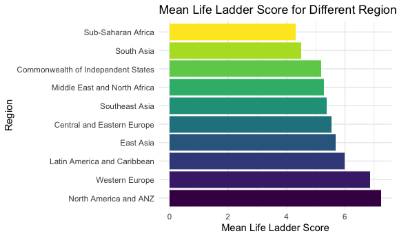
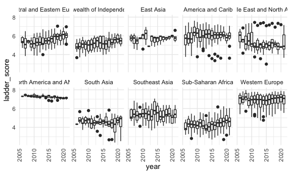
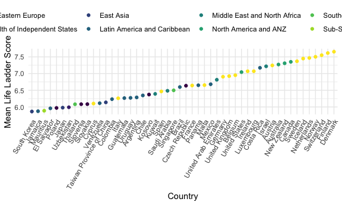

Visualization
================
Landi Guo
2022-12-03

### Mean Life Ladder Score for Each Region

We want to first get a general sense about the differences among life
ladder score for each region by plotting the mean life ladder score for
each region throughout the years.

``` r
region_ladder =
  happ_df %>%
  group_by(regional_indicator) %>%
  summarise(mean_ladder_score = mean(ladder_score)) %>%
  mutate(regional_indicator = fct_reorder(regional_indicator, mean_ladder_score, .desc = TRUE)) %>%
  ggplot(aes(x = regional_indicator, y = mean_ladder_score, fill = regional_indicator)) +
  geom_bar(stat = "identity", show.legend = FALSE) +
  coord_flip() +
  labs(y = "Mean Life Ladder Score",
       x = "Region",
       title = "Mean Life Ladder Score for Different Regions")

region_ladder
```


From the years 2005 to 2021, North America and ANZ region has the
highest mean life ladder score. Western Europe region has the second
highest mean ladder score and is close to North America and ANZ’s.
Sub-Saharan Africa and South Asia have the two lowest mean life ladder
scores in which Sub-Saharan Africa has the lowest mean life ladder
score.

``` r
happ_df %>%
  filter(year != 2005) %>%
  ggplot(aes(x = year, y = ladder_score, group = year)) +
  geom_boxplot() +
  theme(axis.text.x = element_text(angle = 90, vjust = 0.5, hjust = 1)) +
  facet_wrap(~regional_indicator, nrow = 2)
```



``` r
happ_df %>%
  group_by(country_name, regional_indicator) %>%
  summarise(mean = mean(ladder_score)) %>%
  ungroup() %>%
  top_n(50, mean) %>%
  mutate(country_name = fct_reorder(country_name, mean)) %>%
  ggplot(aes(x = country_name, y = mean, color = regional_indicator)) +
  geom_point(stat = "identity") +
  theme(axis.text.x = element_text(angle = 60, vjust = 1, hjust = 1),
        legend.position = "top") +
  labs(x = "Country",
       y = "Mean Life Ladder Score",
       color = "Region")
```

    ## `summarise()` has grouped output by 'country_name'. You can override using the
    ## `.groups` argument.


